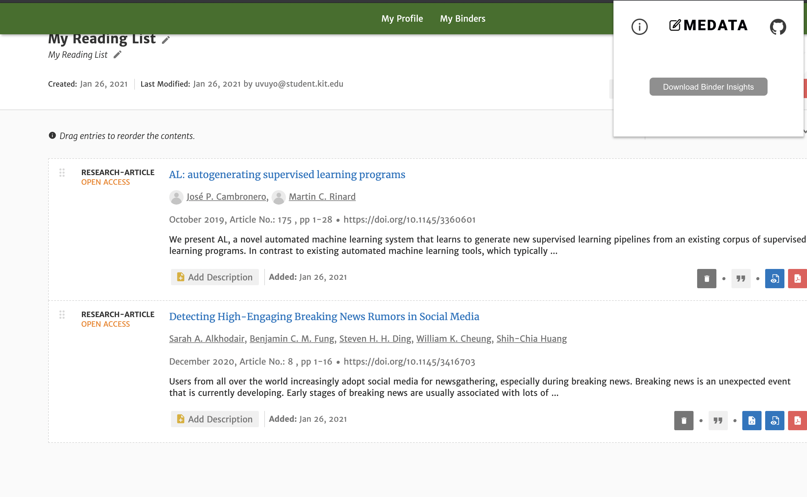

# Medata 

Medata is a chrome-plugin that helps researchers to collect and contribute insights to a paper listed in the [ACM Digital Library](https://dl.acm.org/).

## Installation Backend

In future the backend is going to be hosted online, to setup your own backend:

* clone the GitHub repo ```TODO: link to out repo```
* navigate to the medata_backend folder
* create venv: ```python -m venv venv```
    * run ```venv\Scripts\activate.bat``` (Windows)
    * or ```source venv/bin/activate``` (Mac/Linux) to activate the virtual environment 
* use [pip](https://pip.pypa.io/en/stable/) to install the requirements: ```pip install -r requirements.txt```
* run app.py to start the backend server


## Installation Frontend

The plugin is available in the [chrome web store](https://chrome.google.com/webstore/category/extensions?hl=en), to setup your own frontend:

* navigate to the medata_frontend folder
* ```npm install```
* ```npm run build```
* open Chrome and search for [chrome://extensions/](chrome://extensions/)
* enable developer mode 
* load unpacked extension 
* select the newly created dist-folder 


# Documentation
Detailed documentation:

* [Backend](medata_backend/documentation_backend.md)
  * [__](medata_backend/docs/__init__.html)[init__.py](medata_backend/docs/__init__.html)
  * [acm_scraper.py](medata_backend/docs/acm_scraper.html)
  * [api.py](medata_backend/docs/api.html)
  * [app.py](medata_backend/docs/app.html)
  * [create_real_data.py](medata_backend/docs/create_real_data.html)
  * [models.py](medata_backend/docs/models.html)
* [Frontend](medata_plugin/documentation_frontend.md)
  * [About.vue](medata_plugin/src/docs/About.md)
  * [Home.vue](medata_plugin/src/docs/Home.md)
  * [Binder.vue](medata_plugin/src/docs/Binder.md)
  * [Store(Vuex)](medata_plugin/src/docs/Store.md)
  * [API](medata_plugin/src/docs/Api.md)
  * [Background-Script](medata_plugin/src/docs/Background.md)
  * [Content-Script](medata_plugin/src/docs/Content-Script.md)


## Usage
Go on a [ACM Digital Library](https://dl.acm.org/) website, and click on the plugin to load the available data for the selected paper.


Green insights hold confirmed answers, while answers in a yellow insight still need to be validated by other users. Red insights are without answers - so feel free to add one!

Insights themselves are listed depending on the categories of the paper. But you can always add one and thereby contribute to our database!

The implemented download function allows you to download either the confirmed insights for the selected paper or 
the confirmed insights for multiple papers stored in an ACM-Binder.  



Our plugin relys on a supportive community so please add answers and new insights, confirm existing answers and make use of the report an error function to improve the quality of our database!

## Built With

* [flask-sqlalchemy](https://flask-sqlalchemy.palletsprojects.com/en/2.x/#) - Backend
  * [sqlite](https://www.sqlite.org/index.html)  - Database
* [vue.js](https://vuejs.org/) - Frontend

## Set up the server
You can either decide if you want to run the backend server locally - recommended for testing purposes or if you want to host it online.
### set up local server
Follow the instructions for the installation of the backend. 
1. You have to change in [app.py](medata_backend/python_medata/app.py) the `app.run(host="0.0.0.0")` method to simply `app.run()`
2. In the frontend you have to go to [medata_plugin/src/api/index.js](medata_plugin/src/api/index.js) and change the "`axios.defaults.baseURL = http://127.0.0.1:5000`" 
3. run "`npm run build`" 
4. navigate to the [medata_backend/python_medata](medata_backend/python_medata) folder and run the app.py from there. Otherwise you will run into problems with the download function

### set up webserver
In this part you will find a description how to run your developement server online.
1. Decide which provider you want to go with. We ran our first server on a free tier on the [bw-cloud](https://www.bw-cloud.org). 
2. create a VM with a linux system. We used Ubuntu
3. change the allowed ports so http and https are allowed as well as ssh
3. establish a connection to the server. SSH is the easiest. You can either go with putty or after downloading the private key with this command: "`ssh -i yourKey.ppk user @ip.adress.of.server`"
4. Once the connection is done you can follow this [instruction](https://docs.microsoft.com/en-us/azure-stack/user/azure-stack-dev-start-howto-vm-python?view=azs-2008)
5. instead of cloning the given repo, clone this one
6. the requirements.txt is in the the [medata_backend](medata_backend) folder
7. instead of exporting the FLASK_APP variable you can simply run app.py with "`python3.8 app.py`" when you have navigated to the [python_medata](medata_backend/python_medata) folder

## Contributing
Pull requests are welcome. For major changes, please open an issue first to discuss what you would like to change.

## Authors and acknowledgment
The plugin and the underlying logic was developed by
Kevin Kraus, Max Heydemann, Jan Effenberger, Jan Bode with the support of Merlin Knäble and Tim Rietz 

@IISM - Karlsruhe Institute of Technology

## License
[MIT](LICENSE.md)
